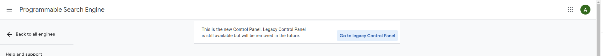

## Pacote google-search

### Requisitos:
- [x] PHP >= 7.1.3
- [x] Composer >= 2
- [x] Autoload do composer Ativado!

### Instalar pacote:
```
$: composer require shieldforce/google-search:dev-main
```

#### Ativar [apis google cloud console apis](https://console.cloud.google.com/apis)
#### Configução [Search Api](http://cse.google.com/cse/create/new)
#### Ou clique no panel para gerenciar uma já criada!


---

### Setando credenciais:
```
Shieldforce\GoogleSearch\Config\Credentials::setCredentials(
    getenv("GOOGLE_APIKEY_SEARCH"),
    getenv("GOOGLE_ID_SEARCH")
);
```

### Fazendo consulta com a busca simples:
```
$list = Shieldforce\GoogleSearch\TypeSearch\Search::run(
    '"CERVEJARIA PETRÓPOLIS"'
);

// Exemplo de retorno:

Array
(
    [page] => 1
    [perPage] => 10
    [start] => 1
    [end] => 2
    [totalResults] => 2
    [results] => Array
        (
            [0] => Array
                (
                    [title] => Grupo Petrópolis - Wikipedia
                    [snippet] => Cervejaria Petrópolis is a Brazilian brewery (cervejaria) company headquartered in Petrópolis. The company has 6 industrial plants located in Petrópolis, ...
                    [htmlSnippet] => Cervejaria Petrópolis is a Brazilian brewery (cervejaria) company headquartered in Petrópolis. The company has 6 industrial plants located in Petrópolis, ...
                    [link] => https://en.wikipedia.org/wiki/Grupo_Petr%C3%B3polis
                    [image] => 
                    [thumbnail] => 
                )
            [1] => Array
                (
                    [title] => Itaipava 100% Malte - Cervejaria Petrópolis - Untappd
                    [snippet] => Itaipava 100% Malte by Cervejaria Petrópolis is a Lager - American which has a rating of 2.4 out of 5, with 873 ratings and reviews on Untappd.
                    [htmlSnippet] => Itaipava 100% Malte by Cervejaria Petrópolis is a Lager - American which has a rating of 2.4 out of 5, with 873 ratings and reviews on Untappd.
                    [link] => https://untappd.com/b/cervejaria-petropolis-itaipava-100-malte/4605067
                    [image] => https://assets.untappd.com/site/beer_logos_hd/beer-4605067_62943_hd.jpeg
                    [thumbnail] => https://encrypted-tbn3.gstatic.com/images?q=tbn:ANd9GcRCdUWJQ0RXDzw5I1Ip-s8pu5rB9l-e6RfaNCKCIep1T9yDBNjd_P9cibGk
                )
        )

)

```

### Fazendo consulta com a busca avançada adicionando parâmetros:
```
$list = Shieldforce\GoogleSearch\TypeSearch\SearchAddParamsAdditional::run(
    '"CERVEJARIA PETRÓPOLIS"',
    [
        "Fraude"    => ["page" => 1, "perPage" => 10],
        "corrupção" => ["page" => 1, "perPage" => 10],
        "Golpe"     => ["page" => 1, "perPage" => 10],
    ]
);

// Exemplo de retorno:

Array
(
    [Fraude] => Array
        (
            [page] => 1
            [perPage] => 10
            [start] => 1
            [end] => 2
            [totalResults] => 2
            [results] => Array
                (
                    [0] => stdClass Object
                        (
                            [title] => Cervejaria Petrópolis é suspeita de sonegar R$ 600 milhões em ...
                            [snippet] => 16 de mai. de 2012 ... ... na fábrica de Boituva da cervejaria Petrópolis, no interior de São Paulo para averiguar a suposta fraude na operação batizada de Czar.
                            [htmlSnippet] => 16 de mai. de 2012 ... ... na fábrica de Boituva da cervejaria Petrópolis, no interior de São Paulo para averiguar a suposta fraude na operação batizada de Czar.
                            [link] => https://exame.com/negocios/cervejaria-petropolis-pode-ter-sonegado-r-600-milhoes-em-impostos/
                            [image] => https://classic.exame.com/wp-content/uploads/2016/09/size_960_16_9_cervejas15.jpg?quality=70&strip=info&w=960
                            [thumbnail] => https://encrypted-tbn1.gstatic.com/images?q=tbn:ANd9GcQVo8IgN4ImYGaUvdjWSPXRwV7ijUMVob0n1QbWiKsQhf40-_xfwDJ7O6E
                        )
                    [1] => stdClass Object
                        (
                            [title] => Operação investiga fraude em empréstimo do BNB à Cervejaria ...
                            [snippet] => 22 de dez. de 2017 ... Operação investiga fraude em empréstimo do BNB à Cervejaria Petrópolis; PF e CGU cumprem mandados. PF e CGU cumprem 14 mandados de busca e ...
                            [htmlSnippet] => 22 de dez. de 2017 ... Operação investiga fraude em empréstimo do BNB à Cervejaria Petrópolis; PF e CGU cumprem mandados. PF e CGU cumprem 14 mandados de busca e ...
                            [link] => https://www.focus.jor.br/operacao-investiga-fraude-em-emprestimo-do-bnb-cervejaria-petropolis-pf-e-cgu-cumprem-mandados-no-ce/
                            [image] => https://www.focus.jor.br/wp-content/uploads/2017/10/BNB.jpg
                            [thumbnail] => https://encrypted-tbn2.gstatic.com/images?q=tbn:ANd9GcSG7-8qoKpaoQkJRCMZQTF6ihYlW7k74JuiU9wYGDzPQXcl8CoByP6ya5o
                        )
                )
        )
    [corrupção] => Array
        (
            [page] => 1
            [perPage] => 10
            [start] => 1
            [end] => 2
            [totalResults] => 2
            [results] => Array
                (
                    [0] => stdClass Object
                        (
                            [title] => MPF pede condenação de Walter Faria, dono da cervejaria Petrópolis
                            [snippet] => 2 de dez. de 2020 ... MPF pede condenação de dono da cervejaria Petrópolis por corrupção. O presidente da Cervejaria Petropolis, Walter Faria - Luiz Carlos ...
                            [htmlSnippet] => 2 de dez. de 2020 ... MPF pede condenação de dono da cervejaria Petrópolis por corrupção. O presidente da Cervejaria Petropolis, Walter Faria - Luiz Carlos ...
                            [link] => https://noticias.uol.com.br/politica/ultimas-noticias/2020/12/02/mpf-pede-condenacao-de-dono-da-cervejaria-petropolis-por-corrupcao.htm
                            [image] => https://conteudo.imguol.com.br/c/interacao/share/conteudo_antigo_xs.png
                            [thumbnail] => https://encrypted-tbn1.gstatic.com/images?q=tbn:ANd9GcSXAVQK3_eJGgys56fsTBW6DvAJHy66_tZBtfET6P2Ke7Gc1vb1tXFe
                        )
                    [1] => stdClass Object
                        (
                            [title] => Caixa 2 de cervejaria era usado em esquema da Odebrecht, diz ...
                            [snippet] => 16 de abr. de 2017 ... ... que precisava de dinheiro não declarado para pagar corrupção. ... Foi assim que Walter Farias, dono da Cervejaria Petrópolis, ...
                            [htmlSnippet] => 16 de abr. de 2017 ... ... que precisava de dinheiro não declarado para pagar corrupção. ... Foi assim que Walter Farias, dono da Cervejaria Petrópolis, ...
                            [link] => http://g1.globo.com/fantastico/noticia/2017/04/cerveja-de-caixa-dois-gerava-dinheiro-para-odebrecht-corromper-politicos.html
                            [image] => http://s.glbimg.com/jo/g1/static/live/imagens/img_facebook.png
                            [thumbnail] => https://encrypted-tbn0.gstatic.com/images?q=tbn:ANd9GcQd8dmCMTcqjCHvmAIWJy2l7VE47JoCN4hPBYByiAvDXUo0Zwzoz87qkEs
                        )
                )
        )
    [Golpe] => Array
        (
            [page] => 1
            [perPage] => 10
            [start] => 1
            [end] => 2
            [totalResults] => 2
            [results] => Array
                (
                    [0] => stdClass Object
                        (
                            [title] => Lava Jato: MPF denuncia dono da cervejaria Petrópolis por ...
                            [snippet] => 4 de set. de 2019 ... A força-tarefa Lava Jato do Ministério Público Federal no Paraná (MPF/PR) denunciou o empresário Walter Faria, dono da cervejaria Petrópolis ...
                            [htmlSnippet] => 4 de set. de 2019 ... A força-tarefa Lava Jato do Ministério Público Federal no Paraná (MPF/PR) denunciou o empresário Walter Faria, dono da cervejaria Petrópolis ...
                            [link] => https://noticias.uol.com.br/politica/ultimas-noticias/2019/09/04/walter-faria-cervejaria-petropolis-lava-jato.htm
                            [image] => https://conteudo.imguol.com.br/c/noticias/7b/2016/04/05/o-presidente-da-cervejaria-petropolis-walter-faria-1459857891866_750x421.jpg
                            [thumbnail] => https://encrypted-tbn2.gstatic.com/images?q=tbn:ANd9GcTO42ZR8H-Bylw6ySyQe-aKlsQBabzrekcLLWmYWrb3TkBu3EYPNHbYjbk
                        )
                    [1] => stdClass Object
                        (
                            [title] => Cervejaria Petrópolis: Lava Jato quer destruir mais uma empresa ...
                            [snippet] => 1 de ago. de 2019 ... ... a coreografia do golpe para a recolonização do Brasil. O alvo é justamente o concorrente que incomoda, o dono da Cervejaria Petrópolis, ...
                            [htmlSnippet] => 1 de ago. de 2019 ... ... a coreografia do golpe para a recolonização do Brasil. O alvo é justamente o concorrente que incomoda, o dono da Cervejaria Petrópolis, ...
                            [link] => https://causaoperaria.org.br/2019/cervejaria-petropolis-lava-jato-quer-destruir-mais-uma-empresa/
                            [image] => https://causaoperaria.org.br/wp-content/uploads/sites/12/2021/07/dco-3-1-300x300.png
                            [thumbnail] => https://encrypted-tbn0.gstatic.com/images?q=tbn:ANd9GcRKpCrkF_aC4VIA-lv4NLRX6amv5I0CkcfOt1PPf0z8v-ukzzx4ge-KKQ8_
                        )
                )
        )
        
)

```